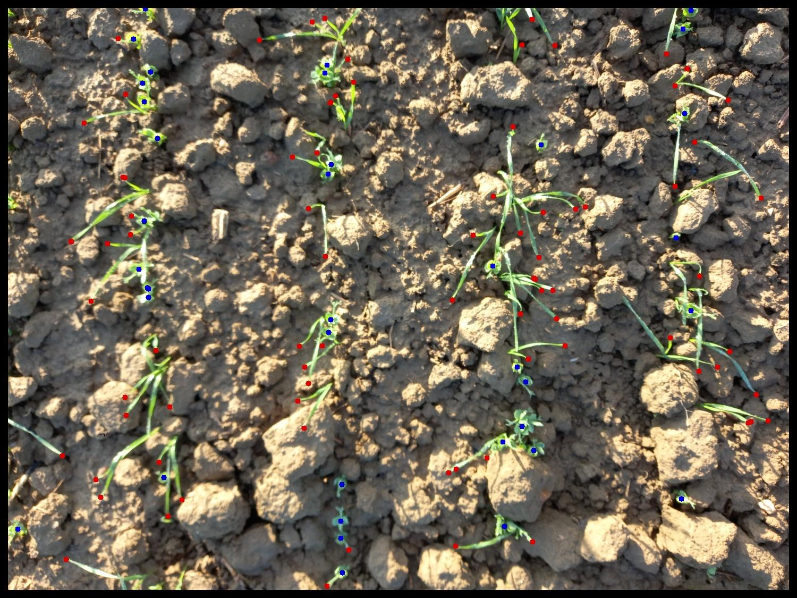

# Point-Based Counting of Cereals and Legumes in Intercropped Fields

Per-species plant counting in wheat and pea intercrops with PET, a point-query transformer for crowd counting. 4.7% MAPE on wheat tips and 7.8% on pea plants. Poster at JDSE 2026 ([HAL](https://hal.science/hal-05765378)).

<p align="center">
  
</p>
<p align="center"><sub>Predictions of the wheat and pea models on a smartphone photo of an intercropped micro-plot.</sub></p>

Plant density per species is a basic measure in intercropping trials, and counting by hand is slow. In a wheat and pea mixture the plants overlap, and the two species must be counted separately. We fine-tune [PET](https://github.com/cxliu0/PET), first trained to count people in crowds, with one model per species, on close-range smartphone photos annotated with points. Whole wheat plants overlap too much to be annotated reliably, so for wheat we count leaf tips, which are easier to localize.

## Results

Test set, images resized to 2048 px on their long side:

| Species | Counted object | MAPE | Point F1 |
| --- | --- | --- | --- |
| Wheat | leaf tips | 4.69% | 74.2% |
| Pea | plants | 7.83% | 86.2% |

The point F1 measures whether each predicted point lands on a true plant or tip, so it checks localization and not only the count. Before settling on PET, we compared class-agnostic few-shot counters (LOCA, PseCo, TasselNetV4) and a density map model (DM-Count). The choices that mattered most were counting wheat tips instead of whole plants, resizing whole images instead of tiling them, and ignoring points near the image edges.

## Environment

The project uses its own environment, `PET_ENV`, defined in [`environment.yml`](environment.yml). The SLURM scripts activate it under this name.

- Python 3.12;
- PyTorch 2.3.1 and torchvision 0.18.1 (the versions used for our results, with CUDA 12.1 on Linux);
- NumPy, SciPy, OpenCV, Matplotlib, and Pillow, and gdown to fetch the crowd counting checkpoint;
- Tkinter for the local annotation tool and output viewer.

Training and evaluation run on a CUDA GPU through SLURM. The annotation tool and the output viewer run locally on any machine with a display. The optional drone tile extraction also needs QGIS and GDAL, installed separately.

```bash
mamba env create -f environment.yml   # create the environment once
mamba activate PET_ENV                # activate it in every new terminal
```

The pretrained weights (VGG16-bn backbone and the ShanghaiTech A checkpoint of PET) are downloaded as described in [docs/usage.md](docs/usage.md#setup).

## Data

For data confidentiality reasons, the field images are not included in this repository. `example_annotations.json` shows the annotation format.

## Quick start

```bash
sbatch pet_final/prepare_pet_data.sh           # point annotations to the PET format
sbatch pet_final/train.sh --wheat              # one model per species
sbatch pet_final/eval.sh --wheat --bordure     # counting and point metrics, edges ignored
sbatch pet_final/infer.sh --images /path/to/photos \
    --ckpt PET/outputs/SHA/pet_wheat_2048/best_checkpoint.pth
```

Every command and its options are in [docs/usage.md](docs/usage.md).

## Repository layout

```
PET/                PET model code (from cxliu0/PET)
pet_final/          data preparation, training, evaluation, and inference
all_annotations/    point annotation tool
drone_extraction/   drone orthomosaic tile extraction
assets/             figures of this README
docs/               usage guide
```

## Documentation

- [Usage](docs/usage.md): setup, annotation, drone tile extraction, every step of the pipeline with its options, and the naming conventions of the outputs.

## References

- B. Pras. Point-based counting of cereals and legumes in intercropped fields. Poster, *11th Junior Conference on Data Science and Engineering (JDSE)*, 2026. https://hal.science/hal-05765378
- C. Liu, H. Lu, Z. Cao, and T. Liu. Point-query quadtree for crowd counting, localization, and more. *ICCV*, 2023.
- Y. Zhang, D. Zhou, S. Chen, S. Gao, and Y. Ma. Single-image crowd counting via multi-column convolutional neural network. *CVPR*, 2016.
- K. Simonyan and A. Zisserman. Very deep convolutional networks for large-scale image recognition. *ICLR*, 2015.
- N. Đukić, A. Lukežič, V. Zavrtanik, and M. Kristan. A low-shot object counting network with iterative prototype adaptation. *ICCV*, 2023.
- Z. Huang, M. Dai, Y. Zhang, J. Zhang, and H. Shan. Point, segment and count: a generalized framework for object counting. *CVPR*, 2024.
- X. Hu, X. Li, J. Xu, A. D. Adan, L. Zhou, X. Zhu, Y. Li, W. Guo, S. Liu, W. Liu, and H. Lu. TasselNetV4: a vision foundation model for cross-scene, cross-scale, and cross-species plant counting. arXiv:2509.20857, 2025.
- B. Wang, H. Liu, D. Samaras, and M. Hoai. Distribution matching for crowd counting. *NeurIPS*, 2020.

## Third-party code

The code in `PET/` comes from [cxliu0/PET](https://github.com/cxliu0/PET) and keeps its own MIT license (see [PET/LICENSE](PET/LICENSE)).
